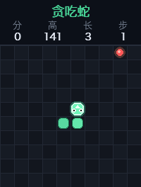

# Snake AI：满图覆盖研究项目

[](https://github.com/louislog/AI_Sanke/stargazers)
[](https://github.com/louislog/AI_Sanke/network/members)
[](https://github.com/louislog/AI_Sanke/issues)
[](LICENSE)
[](https://www.python.org/)
[](https://gymnasium.farama.org/)
[](https://stable-baselines3.readthedocs.io/)

一个以「蛇身覆盖整个地图（满图通关）」为目标的贪吃蛇 AI 研究项目。
不局限于单一 RL 算法，而是提供 **规则 / 搜索 / 混合 / 强化学习 / 模仿学习** 多条算法路线，
配套统一的训练、评估、可视化与失败分析工具链。


## 当前基线成绩（每尺寸 20 局）

| 策略 | 6×6 | 8×8 | 10×10 | 12×12 |
|------|-----|-----|-------|-------|
| random | 4.5 (21%) | 5.2 (13%) | 4.3 (7%) | 4.0 (5%) |
| search | 23 (73%) | 42 (70%) | 64 (67%) | 91 (65%) |
| **hamiltonian / hybrid** | **33 ✓** | **61 ✓** | **97 ✓** | **141 ✓** |

均分（覆盖率）；✓ 表示满图通关率 100%。hamiltonian 与 hybrid 得分相同，hybrid 平均少走约 5~10% 步数。

## 架构分层

```
.
├── ai_snake/                  # 核心库
│   ├── snake_game.py        # 游戏逻辑 + Pygame 渲染（含死因记录）
│   ├── snake_env.py         # Gymnasium 环境：可配置奖励 + 3 种观测模式
│   ├── policies/            # 策略层（统一 BasePolicy 接口）
│   │   ├── grid_utils.py    #   BFS / A* / flood fill / 路径安全模拟
│   │   ├── base.py          #   BasePolicy 抽象 + RandomPolicy
│   │   ├── hamiltonian.py   #   Hamiltonian 回路 + shortcut
│   │   ├── search.py        #   A* 安全寻路 + flood fill 兜底
│   │   ├── hybrid.py        #   前期搜索 + 中后期回路保满图
│   │   └── rl.py            #   SB3 模型适配器
│   ├── algos.py             # RL 算法工厂：PPO / MaskablePPO / DQN / QR-DQN
│   ├── snake_cnn.py         # 栅格观测 CNN 特征提取
│   ├── training_utils.py    # 设备解析、向量化环境、默认超参
│   ├── profiling.py         # 训练与环境 profiling 工具
│   ├── cli.py               # 统一 CLI 入口
│   └── commands/            # 子命令实现
│       ├── train.py         # RL 训练
│       ├── eval.py          # 评估 / 对比 / GIF / 死亡回放
│       ├── imitate.py       # 模仿学习：collect + BC
│       ├── bench.py         # 性能基准：env / obs
│       └── play.py          # 手动游玩
├── scripts/
│   └── tensorboard.sh       # TensorBoard 启动脚本
└── tests/                   # pytest 测试
```

所有操作通过统一 CLI `snake-ai` 调用（`pyproject.toml` 注册，安装后亦可直接 `snake-ai`）：

| 命令 | 说明 |
|------|------|
| `snake-ai train` | RL 训练（课程学习、并行环境、TensorBoard） |
| `snake-ai eval` | 策略评估、多策略对比、GIF / 死亡回放 |
| `snake-ai imitate collect` | 专家演示数据采集 |
| `snake-ai imitate train` | 行为克隆（BC）预训练 |
| `snake-ai bench env` | 环境 step 细分 profiling |
| `snake-ai bench obs` | 观测构造吞吐 benchmark |
| `snake-ai play` | 手动游玩 |

## 快速开始

本项目使用 [uv](https://docs.astral.sh/uv/) 管理依赖与虚拟环境（`pyproject.toml` + `uv.lock`）。

```bash
# 安装依赖（创建 .venv 并锁定版本）
uv sync

# 运行测试
uv run pytest tests/ -q

# 直接看满图基线（无需训练）
uv run snake-ai eval --policy hybrid --grid-size 10 --n-episodes 10
uv run snake-ai eval --policy hybrid --grid-size 10 --out-video docs/assets/demo.gif
```

## 算法路线

### 1. 规则与搜索基线（无需训练，开箱即用）

```bash
# Hamiltonian 回路：满图覆盖的强基线，偶数边长地图 100% 满图
uv run snake-ai eval --policy hamiltonian --grid-size 8 --n-episodes 20

# A* 安全寻路：吃完食物后检查蛇头能否到达蛇尾，防止短视自困
uv run snake-ai eval --policy search --grid-size 8 --n-episodes 20

# 混合策略（推荐）：前期安全寻路吃食物，覆盖率超过 25% 后切回路
uv run snake-ai eval --policy hybrid --grid-size 8 --n-episodes 20

# 多策略 x 多尺寸对比表
uv run snake-ai eval --compare random,search,hamiltonian,hybrid --grid-sizes 6,8,10,12 --n-episodes 20
```

关键机制：

- **Hamiltonian 回路**：预构造经过每格恰好一次的闭合回路，沿回路走永不自撞。
  蛇较短时允许「安全 shortcut」——只要目标格在回路序上不越过蛇尾（留安全余量），
  可以沿回路向前跳，兼顾速度与安全；蛇长超过容量 50% 后禁用 shortcut，纯回路收尾。
- **A* safe path**：找到食物最短路后，先模拟整条路径（含增长），确认吃完后蛇头仍能
  BFS 到达蛇尾才执行；否则追尾或选 flood fill 可达空间最大的方向。
- **flood fill 空间评估**：每个候选动作模拟一步后计算可达空格数，低于蛇身长度视为死路。
- **数学限制**：奇x奇地图（如 7x7、15x15）不存在 Hamiltonian 回路（二分图奇顶点数），
  此时 hybrid 自动退化为纯搜索策略，无法保证满图。

### 2. 强化学习

```bash
# MaskablePPO（默认）+ 8 通道栅格观测 + coverage 奖励 + 课程学习
uv run snake-ai train --algo maskable_ppo --grid-size 10 --curriculum \
    --curriculum-sizes 6,8,10 --total-timesteps 5000000 --n-envs 16

# 其他算法
uv run snake-ai train --algo ppo ...
uv run snake-ai train --algo dqn --buffer-size 200000 ...
uv run snake-ai train --algo qrdqn ...

# 覆盖率达标即提前进入下一课程阶段
uv run snake-ai train --curriculum --coverage-threshold 0.9 ...

# 评估（完整评估请用 snake-ai eval，训练中默认轻量 eval）
uv run snake-ai eval --policy rl --model tmp/best/best_model.zip --grid-size 10
```

#### 快速训练 / GPU / 多进程

本项目瓶颈通常在 **环境 step + BFS/flood fill 奖励与观测**，而非神经网络。
优先用 `--vec-env subproc` 并行采样，再按需启用 GPU。

| 场景 | 推荐命令 |
|------|---------|
| **Mac M 系列 CPU 快速调试**（小图） | `uv run snake-ai train --grid-size 6 --n-envs 8 --vec-env subproc --total-timesteps 200000 --no-eval --eval-freq 999999999` |
| **Mac M 系列正式训练** | `uv run snake-ai train --device mps --vec-env subproc --n-envs 16 --grid-size 10 --curriculum --curriculum-sizes 6,8,10` |
| **Linux + NVIDIA GPU** | `uv run snake-ai train --device cuda --cuda-device 0 --vec-env subproc --n-envs 32 --grid-size 10 --curriculum` |
| **CPU 多进程最大化采样** | `uv run snake-ai train --device cpu --vec-env subproc --n-envs 32 --safety-check-interval 2` |
| **长时间正式训练** | `uv run snake-ai train --algo maskable_ppo --curriculum --grid-size 12 --total-timesteps 10000000 --save-freq 500000 --eval-freq 500000 --n-eval-episodes 10` |

**Profiling 与吞吐：**

```bash
# 仅测环境 step（不含神经网络）
uv run snake-ai bench env --steps 3000 --grid-size 10

# 观测构造 benchmark
uv run snake-ai bench obs --steps 500 --grid-size 10

# 训练时开启 profiling（终端会打印 env/reward/obs 耗时与 FPS）
uv run snake-ai train --profile --total-timesteps 50000 --no-eval
```

**验证 SubprocVecEnv 是否生效：** 训练启动日志会打印 `Vec env: SubprocVecEnv (subproc, n_envs=...)`。
也可在 `--profile` 模式下观察 CPU 多核利用率（建议 `pip install psutil`）。

**查看训练 FPS：** SB3 终端 `time/fps` 或 TensorBoard `time/fps`；`--profile` 时额外打印 `model throughput`。

**主要训练参数：**

| 参数 | 说明 |
|------|------|
| `--device auto/cpu/cuda/mps` | 训练设备（CUDA 不可用时会明确提示原因） |
| `--vec-env dummy/subproc` | 向量化后端（默认 `subproc`） |
| `--n-envs` | 并行环境数 |
| `--safety-check-interval` | flood fill 惩罚计算间隔（默认按地图尺寸） |
| `--eval-freq` / `--n-eval-episodes` | 训练中轻量评估频率与局数 |
| `--no-eval` | 关闭训练中评估，完整评估交给 `snake-ai eval` |
| `--save-freq` / `--log-interval` | checkpoint 与 TensorBoard 日志频率 |
| `--torch-compile true` | 可选编译 policy（实验性） |
| `--profile` | 启用训练 profiling |

观测模式（`--obs-mode`）：

| 模式 | 内容 |
|------|------|
| `grid_full`（默认） | 8 通道：蛇头、蛇身、食物、蛇身顺序场、棋盘掩码、到食物 BFS 距离场、到蛇尾 BFS 距离场、Hamiltonian index 场 |
| `grid` | 3 通道：蛇头、蛇身、食物（旧版兼容） |
| `vector` | 24 维手工特征（旧版兼容） |

奖励预设（`--reward-preset`，定义见 `ai_snake/snake_env.py` 的 `REWARD_PRESETS`，方便消融）：

| 预设 | 设计意图 |
|------|---------|
| `coverage`（训练默认） | 面向满图：死亡惩罚随覆盖率增大、吃食物按覆盖率加成、惩罚自困与可达空间骤降、弱化靠近食物塑形 |
| `default` | 旧版行为 |
| `sparse` | 几乎无塑形，检验算法信用分配能力 |
| `greedy` | 短视对照组：高靠近食物奖励，预期后期表现差 |

### 3. 模仿学习（BC + RL fine-tuning）

```bash
# 1) 用 hybrid 专家采集演示数据
uv run snake-ai imitate collect --policy hybrid --grid-size 8 --n-episodes 500 \
    --obs-mode grid_full --out data/expert_hybrid_8.npz

# 2) 行为克隆预训练
uv run snake-ai imitate train --data data/expert_hybrid_8.npz --grid-size 8 --epochs 30 --out tmp/bc_model

# 3) 评估 BC 模型
uv run snake-ai eval --policy rl --model tmp/bc_model.zip --grid-size 8

# 4) RL fine-tuning（继承 BC 权重）
uv run snake-ai train --init-model tmp/bc_model.zip --grid-size 8 --reward-preset coverage \
    --total-timesteps 2000000
```

**BC + RL 相比纯 RL 的优势**：专家（hybrid）演示直接包含「绕路保命」「沿回路收尾」这类
长期规划行为。纯 RL 要从随机探索中靠稀疏的远期回报发现这些策略，样本效率极低且容易
收敛到「吃到 60~80% 就死」的局部最优；BC 让网络先把专家策略「抄会」，fine-tuning 从
一个已经会玩的策略出发，只需在专家基础上做局部改进。

## 评估体系

`snake-ai eval` 输出：average_score、max_score、average_length、max_length、average_steps、
coverage_ratio、max_coverage、full_map_success_rate、death_reasons（wall / self / timeout）。

```bash
# 死亡回放：保存每次死亡前 90 帧（mp4，无 ffmpeg 时自动转 gif）
uv run snake-ai eval --policy rl --model tmp/best/best_model.zip --replay-dir replays/

# GIF / MP4 演示导出
uv run snake-ai eval --policy hybrid --grid-size 10 --out-video docs/assets/demo.gif

# 实时窗口观看
uv run snake-ai eval --policy hybrid --grid-size 10 --render
```

## 各算法优劣对比

| 路线 | 满图能力 | 训练成本 | 速度（步数/食物） | 泛化性 | 适用场景 |
|------|---------|---------|----------------|--------|---------|
| Hamiltonian | 保证满图（偶数边长） | 0 | 慢（绕全图） | 任意偶数尺寸即时可用 | 满图上限基线 |
| A* safe path | 中等覆盖（~75%） | 0 | 快 | 任意尺寸 | 速度基线、奇x奇兜底 |
| Hybrid | 保证满图 + 较快 | 0 | 中 | 任意尺寸（奇x奇退化） | **推荐默认策略 / 专家数据源** |
| MaskablePPO | 小图可接近满图，需大量训练 | 高 | 学到什么算什么 | 需 padding 观测跨尺寸 | 研究 RL 长期规划上限 |
| DQN / QR-DQN | 通常低于 PPO | 高 | - | 同上 | 离线 / 价值法对照 |
| BC + RL | 接近专家，可再优化 | 中 | 接近专家 | 同上 | 让 RL 跳过冷启动 |

**为什么 Hamiltonian / safe path / 模仿学习比单纯 PPO 更适合满图覆盖**：
满图覆盖本质是长视野路径规划问题——最后 20% 的失误率必须趋近于 0，而错误的代价
（死亡）要到几百步之后才暴露。PPO 这类短期奖励驱动的方法面临三重困难：
信用分配跨度太长（吃最后一个食物可能需要上千步铺垫）、探索难（随机策略几乎不可能
偶然走出回路结构）、风险不对称（92% 与 100% 覆盖的回报差距小但策略难度差距巨大）。
而 Hamiltonian 回路把「不死」变成图论保证，safe path 把「不自困」变成可计算的检查，
模仿学习则把这些结构性知识直接注入网络作为 RL 的起点——三者都绕过了纯 RL 最弱的环节。

## 已知失败场景

1. **奇x奇地图**（7x7、15x15）：不存在 Hamiltonian 回路，hybrid 退化为搜索策略，
   覆盖率约 50~75%，无法保证满图（图论限制，非实现缺陷）。
2. **search 策略后期超时**：蛇很长时安全路径长期不存在，策略持续追尾绕圈不吃食物，
   触发步数上限（表中 `timeout`）。
3. **hybrid 切换窗口**：`switch_ratio` 调高（>0.3）时，长蛇从自由走位贴回回路的过渡期
   偶发自困；默认 0.25 在 6x6~12x12 实测 100 % 满图，但更大地图建议先跑对比验证。
4. **RL 模型跨尺寸迁移**：训练时 `grid_pad_size` 固定，评估尺寸超过 padding 会失败；
   小图模型直接上大图性能显著下降。
5. **大地图（20x20+）的 RL**：即使 coverage 奖励 + 课程学习，PPO 在大图后期仍难以稳定
   收尾，建议 BC（hybrid 专家）+ fine-tuning 路线。

## 后续优化方向

- **动态 Hamiltonian 回路扰动**：周期性局部重构回路（如 banded cycle repair），
  在保持安全不变量的同时进一步缩短吃食物路径。
- **奇x奇地图近似方案**：构造缺一格的近似回路 + 末段搜索收尾。
- **AlphaZero-style MCTS**：以学习的价值网络评估 flood fill 风险，搜索期内做多步规划；
  策略接口已统一，可作为新的 `BasePolicy` 接入。
- **DAgger**：用 hybrid 作为在线专家纠正 BC 学生的分布偏移，替代单轮 BC。
- **Recurrent PPO**：处理部分可观测（观测已含全图，收益可能有限）。
- **课程自动化**：基于 eval 覆盖率自动伸缩课程（已支持 `--coverage-threshold`，
  可扩展为自动回退）。

## 手动游玩

```bash
uv run snake-ai play
```

方向键 / WASD 控制，撞死后按 `R` 重开，`ESC` 退出。

## TensorBoard 与训练日志

```bash
bash scripts/tensorboard.sh
```

`snake-ai train` 的 `verbose=1` 终端日志分三组：**rollout/**（采样表现）、**time/**（进度）、
**train/**（梯度更新）。

| 想看什么 | 主要看 |
|----------|--------|
| 蛇玩得怎么样 | `rollout/ep_rew_mean`、`rollout/ep_len_mean` |
| 训练到哪了 | `time/total_timesteps`、`time/iterations` |
| 更新是否稳定 | `train/approx_kl`、`train/clip_fraction` |
| 探索 vs 利用 | `train/entropy_loss` |
| 价值网络是否学好 | `train/explained_variance`、`train/value_loss` |

选模型以 `EvalCallback` 写入的 `tmp/best/best_model.zip` 为准，而非最后一轮 rollout 数值。

## 参考

- [helicopter-rl](https://github.com/rossning92/helicopter-rl)
- [Stable-Baselines3](https://stable-baselines3.readthedocs.io/)
- [Gymnasium](https://gymnasium.farama.org/)
- [AlphaPhoenix: How to Win Snake](https://www.youtube.com/watch?v=TOpBcfbAgPg)（Hamiltonian 扰动思路）

## Star 趋势

[](https://star-history.com/#louislog/AI_Sanke&Date)

## 许可证

[MIT](LICENSE)
